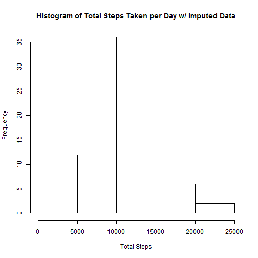
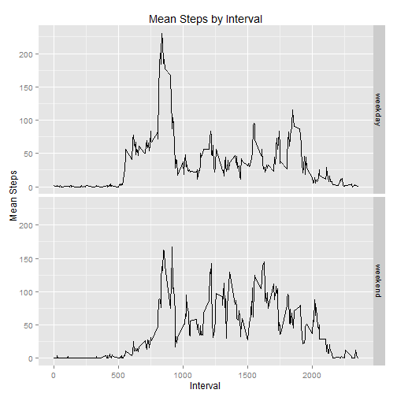

## Loading and preprocessing the data

First, load the dataset. I did not do any preliminary processing.


```r
setwd("~/datascience/datasciencecoursera/RepData_PeerAssessment1")
df <- read.csv("activity.csv", na.strings = c("NA"))
library(dplyr)
library(ggplot2)

head(df)
```

```
##   steps       date interval
## 1    NA 2012-10-01        0
## 2    NA 2012-10-01        5
## 3    NA 2012-10-01       10
## 4    NA 2012-10-01       15
## 5    NA 2012-10-01       20
## 6    NA 2012-10-01       25
```

## What is mean total number of steps taken per day?

First create data table of total steps by day, then extract the second column as vector for future use


```r
steps <- df %>% group_by(date) %>% summarise (total_steps = sum(steps)) 
vector <- collect(select(steps, total_steps))[[1]]
steps
```

```
## Source: local data frame [61 x 2]
## 
##          date total_steps
## 1  2012-10-01          NA
## 2  2012-10-02         126
## 3  2012-10-03       11352
## 4  2012-10-04       12116
## 5  2012-10-05       13294
## 6  2012-10-06       15420
## 7  2012-10-07       11015
## 8  2012-10-08          NA
## 9  2012-10-09       12811
## 10 2012-10-10        9900
## ..        ...         ...
```

Now that you have a vector of total steps by day, create histogram of total steps per day


```r
hist(vector, xlab = "Total Steps", main = "Histogram of Total Steps Taken per Day")
```

 


Using the same vector, calculate the mean and median total steps per day, removing the NA values


```r
mean(na.omit(vector))
```

```
## [1] 10766.19
```

```r
median(na.omit(vector))
```

```
## [1] 10765
```

## What is the average daily activity pattern?

First, summarize Data into means steps per interval over all days and then plot


```r
ts <- df %>% group_by(interval) %>% summarise (mean_steps = mean(na.omit(steps)))
plot(ts, type="l", xlab = "5-Minute Interval", ylab="Mean Steps Taken", main = "Time Series Plot of Mean Steps Taken by Interval")
```

 

The 5-Minute Interval with Maximum Number of Steps is 835


```r
ts[which(ts$mean_steps == max(ts$mean_steps)),]
```

```
## Source: local data frame [1 x 2]
## 
##   interval mean_steps
## 1      835   206.1698
```

## Imputing missing values

Total Number of Missing Values in Data Set is 2304


```r
nrow(df[is.na(df$steps),])
```

```
## [1] 2304
```

Impute Missing Values by splitting original data into two sets: non missing and missing steps. Impute non-missing with mean steps by interval calculated above and recombine the datasets.


```r
missing <- df[which(is.na(df$steps)),]
nonmissing <- df[which(!is.na(df$steps)),]

missing <- left_join(x=missing,y=ts,by=c("interval"))
missing <- missing[,c("mean_steps","date", "interval")]
colnames(missing) <- c( "steps","date", "interval")

imputed <- rbind(missing, nonmissing)
```

Here you can see that the missing values were filled in by comparing the original date set to the imputed data set.


```r
head(df)
```

```
##   steps       date interval
## 1    NA 2012-10-01        0
## 2    NA 2012-10-01        5
## 3    NA 2012-10-01       10
## 4    NA 2012-10-01       15
## 5    NA 2012-10-01       20
## 6    NA 2012-10-01       25
```

```r
head(imputed)
```

```
##       steps       date interval
## 1 1.7169811 2012-10-01        0
## 2 0.3396226 2012-10-01        5
## 3 0.1320755 2012-10-01       10
## 4 0.1509434 2012-10-01       15
## 5 0.0754717 2012-10-01       20
## 6 2.0943396 2012-10-01       25
```


Repeat the procedure above using the imputed dataset: First create data table of total steps by day, then extract the second column as vector for future use


```r
steps <- imputed %>% group_by(date) %>% summarise (total_steps = sum(steps)) 
vectortwo <- collect(select(steps, total_steps))[[1]]
```

Now create histogram of steps per day


```r
hist(vectortwo, xlab = "Total Steps", main = "Histogram of Total Steps Taken per Day w/ Imputed Data")
```

 


Calculate and report the Mean and Median of Steps Taken Per Day using the imputed dataset. Note that you must omit NA values.


```r
mean(na.omit(vectortwo))
```

```
## [1] 10766.19
```

```r
median(vectortwo)
```

```
## [1] 10766.19
```

Now compare to the calculated mean and median using the non-imputed data set. The means are unchanged, while the median has shifted with the introduction of new values

Means:

```r
mean(na.omit(vector))
```

```
## [1] 10766.19
```

```r
mean((vectortwo))
```

```
## [1] 10766.19
```

Medians:

```r
median(na.omit(vector))
```

```
## [1] 10765
```

```r
median(vectortwo)
```

```
## [1] 10766.19
```

Because I used mean imputation by interval, there is no change in mean but a change in median The mean for nonimputed set is 10766.19, and for imputed is 10766.19. The median changes from 10765 to 10766.19. Also,
there is a greater frequency of values around the mean in the histogram using my imputation strategy

## Are there differences in activity patterns between weekdays and weekends?

To evaluate the difference in activity patterns between weekdays and weekends, you must create a factor variable that takes the date and turns it into "weekday" or "weekend" depending on what day of the week it is


```r
library(lubridate)
imputed$date <- ymd(as.character(imputed$date))

imputed$weekday <- weekdays(imputed$date)

imputed$daytype <- as.character(0)
imputed[which(imputed$weekday == "Saturday" | imputed$weekday == "Sunday"),"daytype"] <- as.character("weekend")
imputed[which(imputed$weekday == "Monday" | imputed$weekday == "Tuesday" | imputed$weekday == "Wednesday"
              | imputed$weekday == "Thursday"| imputed$weekday == "Friday"),"daytype"] <- as.character("weekday")
imputed$daytype <- as.factor(imputed$daytype)

head(imputed)
```

```
##       steps       date interval weekday daytype
## 1 1.7169811 2012-10-01        0  Monday weekday
## 2 0.3396226 2012-10-01        5  Monday weekday
## 3 0.1320755 2012-10-01       10  Monday weekday
## 4 0.1509434 2012-10-01       15  Monday weekday
## 5 0.0754717 2012-10-01       20  Monday weekday
## 6 2.0943396 2012-10-01       25  Monday weekday
```

Now you can create a panel plot to view the time series data side-by-side to note differences


```r
ts_weekday <- imputed %>% group_by(daytype,interval) %>% summarise (mean_steps = mean(na.omit(steps)))

p1 <- ggplot(ts_weekday, aes(x=interval, y=mean_steps)) +
  geom_line() +
  ggtitle("Mean Steps by Interval") +
  xlab("Interval")+
  ylab("Mean Steps")

p1 + facet_grid(daytype ~ .)
```

 

As you can see from the plot, there seems to be an overall increase in steps, though the maximum of the average steps by interval has decreased.
